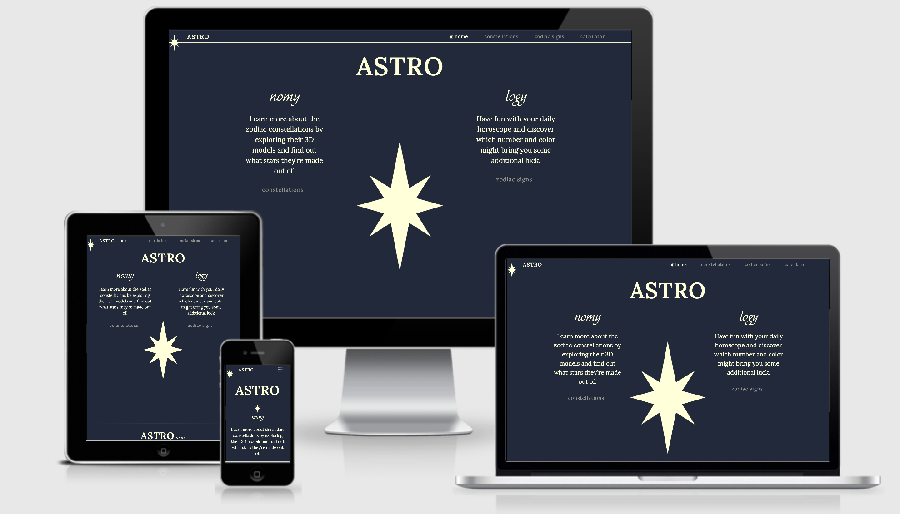
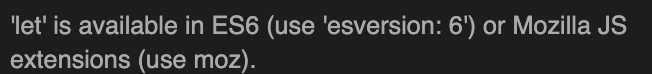
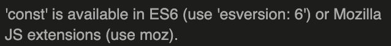
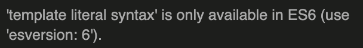
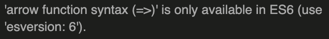
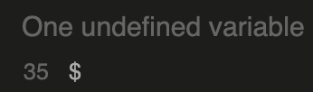
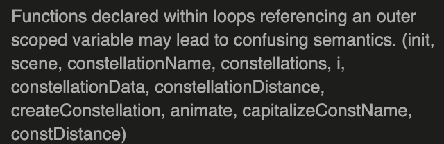
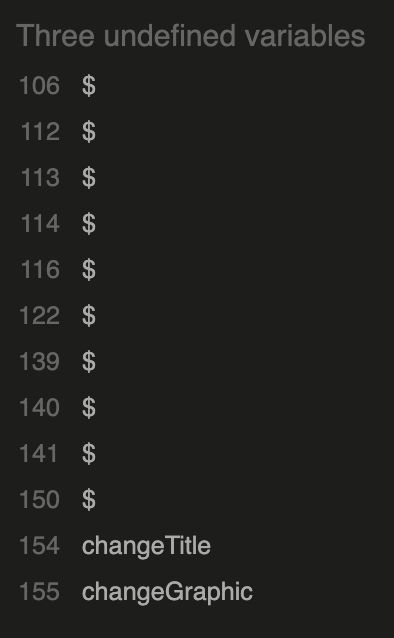
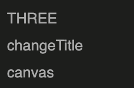
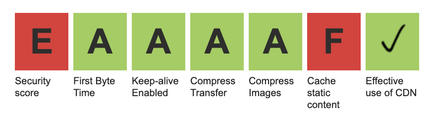

<h1 align="center">ASTRO</h1>
<h1 align="center"></h1>

 <a href="https://liigalized.github.io/astro/"> :star2:	</a> :point_left: Live website

   :point_left: GitHub Repository
 
 ## About

This website connects Astronomy and Astrology while highlighting unique aspects of both. It provides an entertaining way to get familiar with either through exploring 12 zodiacs and how they're represented in each field. 

## Table of Contents

[User Experience (UX)](#UX)

[Features](#features)

[Technologies Used](#technologies)

[Testing](#testing)

[Deployment](#deployment)

[Known Bugs](#bugs)

[Credits](#credits)

## User Experience (UX)

### User Stories
- #### As a visitor looking for entertainment.
    1. I want to easily understand the purpose and the layout of the site without additional instructions needed.
    1. I want to intuitively navigate through the site to browse the content.
    1. I want to be able to interact with the site engagingly.
- #### As a visitor interested in Astronomy and constellations.
    1. I want to easily find the relevant page.
    1. I want to be able to navigate through different constellations easily.
    1. I want to be able to view each constellation in 3D and interact with it.
    1. I want to see details about starts that make up each constellation.
    1. I want to see details about each constellation.
- #### As a visitor interested in Astrology and zodiacs.
    1. I want to easily find the relevant page.
    1. I want to see more facts about each zodiac.
    1. I want to find out what dates each zodiac corresponds to.
    1. I want to read my horoscope.
- #### As a returning visitor looking for the daily horoscope.
    1. I want the site to be responsive on all devices and across all browsers.
    1. I want to access my daily horoscope.
    1. I want to be able to quickly access the needed information.
- #### As a visitor looking to learn more about Astronomy, Astrology, or both.
    1. I want the text to be easily readable.
    1. I want concise information that's easily understandable.
    1. I want to be able to find out what is my zodiac.
    1. I want to understand what is the difference and the connection between Astrology and Astronomy.

### Design

- #### Color scheme
    - Since the content of this website is space-related (astronomy and astrology), 
    I aimed to create a 'night-sky' color theme. To achieve this I opted to use a dark background with light text/graphics 
    and even darker accent color while maintaining high enough contrast for readability. 
    I chose to keep the color scheme minimal to create a classy, timeless, and almost mysterious look and create a sense of wonder in the user. 
    The main colors used are Prussian Blue (#1F293B), Light Goldenrod Yellow (#FFFFD6) and as an accent color, 
    I used Rich Black FOGRA 29 (#131A27). To pick the exact shades of the colors I used  [coolors](https://coolors.co/) 
    color palette generator.

        

- #### Typography
    - The main font used across all pages is a serif type of font 'Lora' with serif as a fallback font. 
    This font is meant to increase the quality and speed of readability to counteract possible difficulties of reading 
    light text on a dark background.

        

    - The secondary font used is a decorative font 'Elina'. This font is used as a style choice in headings as 
    well as an accent throughout pages. This font is cursive and very elegant and is meant to add to the classy look of the page.

        

- #### Imagery
    - The main purpose of the graphics used is to be informative as they accurately illustrate the zodiac sign or the constellation in 2D.
    The secondary purpose of the minority of graphics used is decorative, such as the star on the home page. However, 
    all the graphics were custom designed and drawn either by me or by a graphic designer 
    Claire Schorman and were meant to elevate the design of the page.
    - No pictures were used in making of this website.

- #### Wireframes
    - Wireframes were created using Adobe Xd
    - [Mobile Wireframes](https://xd.adobe.com/view/2a79d65c-c500-4c4f-9b90-1c46911d4481-7f2a/) :point_left:

         

    - [Tablet Wireframes](https://xd.adobe.com/view/ba88fbbf-32f5-4e31-a0ba-96a6c10e95c6-efdb/) :point_left:

         

    - [Desktop Wireframes](https://xd.adobe.com/view/671f703f-ebfc-4020-ba17-d3a65926fb3b-324c/) :point_left:

         

- #### Mockups
    - Mockups were created using Adobe Xd
    - [Mobile Wireframes](https://xd.adobe.com/view/3259bb2c-4e92-4f22-b7d1-f9e940c483b3-670a/) :point_left:

         

    - [Tablet Wireframes](https://xd.adobe.com/view/6acb81ec-f1bd-4a86-a230-8b36916d4c4d-3f98/) :point_left:

         

    - [Desktop Wireframes](https://xd.adobe.com/view/be323bd5-5574-4702-9f7b-52ae8c3de42e-eb61/) :point_left:

         

 
## Features

### Existing Features

#### Common Features Across All Pages
- [x] **Header** - allows user to easily navigate across all pages
    - The header itself is positioned to always be visible (positioned absolutely using Bootstrap 'sticky-top' class) at the top of the screen (mobile, tablet, and desktop) which allows visitors to find it quickly.
    - The brand logo as well as brand word is positioned on the left and is visible on all pages, it serves as a home page link so the user can find her/his way back if needed.
    - Navigation is included in the header to let the user intuitively locate it.
    - Navigation links become lighter and have a star icon become visible (only in desktop) when hovered over. This lets the visitor know that it is clickable.
    - The navigation link, matching the page that the user is visiting, stays 'active'(which matches the hover effect from the previous point) to let the user quickly establish which page she/he is visiting.
    - Navigation links collapse in a personalized hamburger menu when viewed in mobile sizes.
    - Colors have been chosen with optimum contrast in mind to be pleasant to the eye.
- [x] **Headings**
    - All main heading styles have been applied using JavaScript ([main.js](https://github.com/liigalized/astro/blob/master/assets/scripts/main.js)) to avoid cluttering HTML and provide consistency throughout all pages.
- [x] **Links/buttons**
    - All links and buttons have been styled uniformly to let the user know without hovering over that those are clickable.
    - When the user hovers over, the link/button text increase in brightness.
    - Most of the links/buttons (with two purposeful exceptions), have the page brand star icon become visible on the left side when hovered over.
    - The star graphic on all links is generated in JavaScript ([main.js](https://github.com/liigalized/astro/blob/master/assets/scripts/main.js)) to avoid cluttering HTML file and provide consistency throughout all pages.
- [x] **Responsiveness**
    - All Pages are responsive and provide the same functionality regardless of the viewport size.
- [x] **Accessibility**
    - There are no flashing images or sounds to hinder the user experience.
    - All button graphics used, have been added as a background to prevent screen readers from having to read out each image description.
- [x] **Graphic Buttons**
    - When a button, displaying a constellation or zodiac sign, is clicked, it changes the heading in the main container and the icon related to the main container (if any).
    - This functionality is done by using JavaScript ([main.js](https://github.com/liigalized/astro/blob/master/assets/scripts/main.js))
    - Graphic buttons are generated using JavaScript ([main.js](https://github.com/liigalized/astro/blob/master/assets/scripts/main.js))
- [x] **Footer**
    - Footer has been designed, using Bootstrap, to always be at the bottom of the page, regardless of the amount of content. This aids the overall user experience.
    - Content has been broken down into two lines to avoid overcrowding.
    - Social links have been grouped to signify their connection and, once clicked, redirect the user to a new page.
    - All links when hovered over an increase in brightness (opacity) to intuitively signal that they are clickable.
    - 'About' button linked to the 'About' section on the 'Home' page.

### Specific to Pages
- [x] **Home**
    - The main background star graphic helps to set the mood of the website and acts as a separator for the astrology and astronomy sections. It changes size as the background is resized.
    - Short descriptions of what the 'Constellations' and the 'Codiac signs' pages feature, as well as the call-to-action button attached for the user to be able to easily navigate if they are interested.
    - 'About' section providing more information about what Astrology and Astronomy are and the connection between both.
    - Clickable headings of each 'About' topic, when clicked, the relevant paragraph is displayed while others are hidden. This is achieved using JavaScript ([index.js](https://github.com/liigalized/astro/blob/master/assets/scripts/index.js))
- [x] **Constellations**
    - Short page describer that provides the user some information about the page and what the models are.
    - Graphic buttons displaying a 2D view of each constellation, that let the user select which constellation model they wish to view.
    - Instructions for the user on how to use the 3D models.
    - 3D models of each constellation that are interactive (clickable, zoomable, draggable).
    - Each star allows the user to click on it to display more information in the data container next to it.
    - When hovered over, each star increases in brightness to indicate which star is hovered over.
    - Instructions button at the bottom fo the 3D model container to allow the user to easily find the instructions in case they are unsure how to operate the model.
    - A Reset button allows the user to easily reset the original view of the constellation in case it has been distorted too much.
    - Data container dynamically changes information regarding what constellation and what star has been, the reset button resets the star data as well.
    - A short paragraph at the bottom of the page containing a link so that the user can easily navigate to the zodiac page.
    - All functionality (apart from the links) has been done in JavaScript ([models.js](https://github.com/liigalized/astro/blob/master/assets/scripts/models.js)) and the models have been created using the [Three.js](https://threejs.org/).
- [x] **Zodiac Signs**
    - Short page describer that provides the user information about the zodiac signs.
    - Graphic buttons displaying each zodiac sign, that lets the user select which zodiac sign they would like to learn more about.
    - A dynamic heading and icon that is populated once the user selects the zodiac sign. This lets the user immediately get a validation that the correct zodiac sign has been selected.
    - Daily Horoscope, Lucky Number, and Lucky Color fields that are populated using [aztro API](https://rapidapi.com/sameer.kumar/api/aztro).
    - Daily Horoscope is updated daily which provides the user with a reason to return to the website daily.
    - A short paragraph at the bottom of the page containing a link so that the user can easily navigate to the zodiac page.
    - All functionality is achieved by using JavaScript([zodiac.js](https://github.com/liigalized/astro/blob/master/assets/scripts/zodiac.js)).
- [x] **Calculator**
    - This page allows the user to find out what zodiac sign they are, in case they are not familiar with it.
    - Month selector and Day selector that is populated with a precise number of days depending on what month the user selected. This helps the user to chose an accurate date.
    - A call-to-action button that displays the relevant zodiac/constellation name, zodiac sign and constellation sign at the bottom.
    - Zodiac sign and Constellation sign graphics have the relevant page buttons underneath for easy navigation.
    - The functionality was achieved by using JavaScript ([calculator.js](https://github.com/liigalized/astro/blob/master/assets/scripts/calculator.js))

### Future Features
 
- [ ] Light website theme to cater to users who prefer viewing dark text on light backgrounds.
        
- [ ] Have a split home page view that would let the user move the page splitter to reveal either the Astronomy or Astrology sections.
        
    - I have created initial mockups for both features named above ([Mobile](https://xd.adobe.com/view/414ea735-999e-4489-86fa-48abc1b58a15-141d/), [Tablet](https://xd.adobe.com/view/d2cb1b98-c3d2-4c08-862b-4897b602164b-8798/), [Desktop](https://xd.adobe.com/view/d1f04f67-190e-4729-b08d-b5b16bfdca62-84a3/))
- [ ] On the 'Constellations' page, implement additional information (when best visible from a certain location with a map, star's distance from the Earth, brightness) of each star with the option to select 'Basic' or 'Advanced' data. This would allow users to toggle how much information they wish to see.
- [ ] On the 'Zodiac' page, add further data about each zodiac sign, such as zodiac sign matches, mood, and user's lucky time.
- [ ] Add a log-in option that allows the user to have an account and remember their specific details such as certain starts they are interested in, their location, and their zodiac sign.
- [ ] Have the daily horoscope being sent to the user's e-mail if they wish so.

## Technologies Used

### Languages Used

- [HTML5](https://en.wikipedia.org/wiki/HTML5)
- [CSS3](https://en.wikipedia.org/wiki/Cascading_Style_Sheets)
- [JavaScript](https://www.javascript.com/)

### Frameworks, Libraries and Programs Used
- [Three.js](https://threejs.org/) - Three.js docs and examples were used to create the constellation models and implement the interactiveness of them. Even though the functionality of most pages was written using jQuery, the models were coded using plain JavaScript. This is due to all docs and examples being in plain JavaScript.
- [RapidAPI](https://rapidapi.com/) - Used to find Astrology API that was used for daily horoscope and other zodiac data.
- [jQuery](https://jquery.com/) - Used in writing most of the functionality in 'Home', 'Zodiac' and 'Calculator' pages. Additionally, some of the clickable elements in Bootstrap, such as collapsable 'hamburger' navbar and collapse element, uses jQuery as well.
- [popper.js](https://popper.js.org/) - Used in some of the clickable elements such as collapsable 'hamburger' navbar and collapse element.
- [Bootstrap v4.5.0](https://getbootstrap.com/) - Used for the responsive layout as well as the navigation bar, hamburger menu and the footer.
- [Font Awesome](https://fontawesome.com/) - Font Awesome was used to add social media icons at the bottom of the page.
- [Google Fonts](https://fonts.google.com/) - Google Fonts was used to import 'Lora' font in the main.css file.
- [Adobe Fonts](https://fonts.adobe.com/) - Adobe Fonts was used to import 'Elina' font which was the accent font in this project and cannot be found on Google Fonts website.
- [Git](https://git-scm.com/) - Git was used to allowing for tracking of any changes in the code and version control.
- [GitPod](https://www.gitpod.io/) - GitPod, connected to GitHub, hosted the coding space and allowed the projected to be committed to the Github repository.
- [Github](https://github.com/) - GitHub is used to host the project files and publish the live website by using Git Pages.
- [Lightroom](https://www.adobe.com/ie/products/photoshop-lightroom.html?gclid=CjwKCAjwwYP2BRBGEiwAkoBpAqomS77OrQwQggC9QPnPACrkLBs-2AcrW9ZUvxbUJnFOgbRGKNeNEhoC95IQAvD_BwE&sdid=88X75SKS&mv=search&ef_id=CjwKCAjwwYP2BRBGEiwAkoBpAqomS77OrQwQggC9QPnPACrkLBs-2AcrW9ZUvxbUJnFOgbRGKNeNEhoC95IQAvD_BwE:G:s&s_kwcid=AL!3085!3!394412108599!e!!g!!lightroom) - Lightroom was used to edit and resize all images.
- [Photoshop](https://www.adobe.com/ie/products/photoshop.html?gclid=CjwKCAjwwYP2BRBGEiwAkoBpAuYIg7JHUAFtnRQB28LDaU5gvFxhLX_56PYV2xbl6bTKvYSjK5yoLhoCkjQQAvD_BwE&sdid=88X75SKS&mv=search&ef_id=CjwKCAjwwYP2BRBGEiwAkoBpAuYIg7JHUAFtnRQB28LDaU5gvFxhLX_56PYV2xbl6bTKvYSjK5yoLhoCkjQQAvD_BwE:G:s&s_kwcid=AL!3085!3!340674288378!e!!g!!photoshop) - Photoshop was used to create the background graphic for the Landing page as well as the favicon.
- [Adobe Xd](https://www.adobe.com/ie/products/xd.html) - Adobe Xd was used to create wireframes and mockups.

## Testing

 ### Functionality Testing
- #### Navigation bar
    - When the brand name 'ASTRO' is clicked, it brings the user to the Home Page. This has been tested on desktop, tablet, and mobile views and from all pages.
    - When the brand star is clicked, it brings the user to the Home Page. Tested as mentioned in the previous point.
    - All links are working and have been tested.
    - The hamburger menu appears on screen sizes smaller than 768px. When clicked/tapped, it expands to reveal page links. These have been tested and are working as expected.
    - The navigation bar stays at the top of the page on all screen sizes.
- #### Footer
    - Footer is always located at the bottom of the page regardless of the content amount. This was tested by removing all content from any given page.
    - When the social links are clicked, they open the relevant social media page in a new tab.
    - When the 'About' link is clicked, it brings the user to the 'About' section on the Home page. This has been tested on all pages.
- #### The dynamic text change on the Home Page
    - When the user clicks on any of the headings (Astronomy, Astrology, or Connection), the selected heading smoothly increases in size, the previous description fades out, the relevant new description fades in.
- #### The Graphic Buttons
    - All graphic buttons display the relevant constellation/zodiac name when clicked on.
    - When clicked on, all graphic buttons on the 'Zodiac Sign' page display the relevant zodiac sign in the zodiac container.
    - On the 'Constellations' page when a graphic button is clicked on, it displays the chosen 3D model and information about the constellation in the data container (name of the constellation and the distance from Earth).
    - On the 'Zodiac Signs' page, when clicked on, it displays chosen daily horoscope, Lucky Number and Lucky Color.
- #### 3D Constellation models
    - Each model can be rotated, resized, and dragged. This has been tested on mobile devices, tablets, and desktops.
    - In desktop view, When the user hovers over any given star, it's brightness increases. On mobile, a star will increase in brightness when tapped on.
    - When a star is tapped/clicked on, its name and type are displayed in the data container.
    - The instructions button displays the instructions when clicked/tapped.
    - Reset button resets the view of the constellation the user was looking at, if the instructions button has been selected following a reset button, the previous constellation will be displayed.
- #### Data container for constellation models
    - Initially, no star specific data is being displayed until the user chooses a star by clicking/tapping after choosing a constellation.
    - Initially, no constellation specific data is being displayed until the user chooses a constellation by clicking/tapping one of the graphic buttons.
    - Once the user selects a constellation, it's name and distance from the earth will be displayed.
    - Once the user selects a star, its name and type will be displayed.
    - Reset button under the 3D models will reset the star specific data, however, not the constellation specific data as the constellation remains selected.
- #### Data container for zodiac signs connected to the API
    - When the user chooses a zodiac sign by clicking a graphic button, Daily Horoscope, Lucky Number and Lucky Color will be populated.
    - The name of the zodiac as well as its image are updated as well.
- #### Zodiac Sign calculator
    - When the user selects a month, the day selector is updated with the precise number of days in the chosen month.
    - If no month has been selected, the day selector will not be populated.
    - When the user clicks on the 'Find Out' button, it populates the bottom container with relevant zodiac/constellation names and icons.
    - The page buttons underneath each graphic icon bring the user to the relevant pages.
    - If the user tries to navigate back to the calculator using the 'back' button, the page refreshes to clear the previous selection.
-  #### All external links were tested to make sure they open up the correct pages in new tabs
    - All social links in the footer bring the user to the relevant social pages that open in a new tab.
- #### All internal links were tested to make sure that all pages are correctly connected 
    - Navigation links bring the user to the relevant pages.
    - Brand word and icon located in the navigation bar always brings the user to the home page.
    - Links connecting the 'Constellations' page to the 'Zodiac Signs' page and vice versa work and have been tested.
    - All page links on the 'Home' page and the 'Calculator' page are working as expected and redirect the user to the relevant pages.

### HTML5 validator
- Home Page - Pass - [Results](https://validator.w3.org/nu/?showsource=yes&showoutline=yes&showimagereport=yes&doc=https%3A%2F%2Fliigalized.github.io%2Fastro%2Findex.html)
- Constellations Page - Pass - [Results](https://validator.w3.org/nu/?showsource=yes&showoutline=yes&showimagereport=yes&doc=https%3A%2F%2Fliigalized.github.io%2Fastro%2Fconstellations.html)
- Zodiac Signs Page - Pass - [Results](https://validator.w3.org/nu/?showsource=yes&showoutline=yes&showimagereport=yes&doc=https%3A%2F%2Fliigalized.github.io%2Fastro%2Fzodiac.html)
- Calculator Page - Pass - [Results](https://validator.w3.org/nu/?showsource=yes&showoutline=yes&showimagereport=yes&doc=https%3A%2F%2Fliigalized.github.io%2Fastro%2Fcalculator.html)

### CSS3 validator - Pass

 :point_left: Results

### JSHint validator - no major issues
- The warnings received back across all JavaScript files - all of these but one are ES6 related and considered to be the best practice in coding
    - An issue with `let` variable
    
    

    - An issue with `const` variable
    
    

    - An issue with template literals
    
    

    - An issue with arrow function syntax
    
    

    - Undeclared $ variable - this is a jQuery variable defined within jQuery library
    
    

- File specific issues 
    - Functions being declared within loops in **models.js** - this was needed to create functionality for each button to be able to display a matching constellation.
    
    

    - Undefined variables in **calculator.js** file - these are functions that have been declared in the main.js file and have been linked to the same HTML document.

    

    - Undefined variables in ***models.js* file - these are functions declared in a different JS file. THREE and canvas variables have been declared within the Three.js library.

    
### Usability Testing
- To test the ease of navigation, this website was shared with friends and family of different ages and different levels of computer/smart device knowledge. There were no issues identified regarding the simplicity of navigating the website.
- The testers also verified that all functionality aspects are working as explained above and as expected.
- Testers expressed that the design is easy to understand and navigate.

### Compatibility Testing
- Browser Compatibility

    | Screen size\Browser | Safari           | Opera            | Microsoft Edge   | Chrome           | Firefox          | Internet Explorer |
    | --------------------|:----------------:|:----------------:|:----------------:|:----------------:|:----------------:|:-----------------:|
    | Mobile              |:heavy_check_mark:|:heavy_check_mark:|:heavy_check_mark:|:heavy_check_mark:|:heavy_check_mark:| Not Tested        |
    | Desktop             |:heavy_check_mark:|:heavy_check_mark:|:heavy_check_mark:|:heavy_check_mark:|:heavy_check_mark:| Not Tested        |
    | Tablet              |:heavy_check_mark:|:heavy_check_mark:|:heavy_check_mark:|:heavy_check_mark:|:heavy_check_mark:| Not Tested        |

- OS Compatibility was tested on iOS 13.6.1, Android 10.0, MacOS Catalina v10.15.6, iPadOS 13.6.1, and Windows 10 'May 2020 update'. It is yet to be tested on Unix, Linux or Solaris Operating Systems.
- The devices used in this testing include Macbook Pro, Toshiba laptop, iPad Pro, iPhone Xr, Xiaomi 3, HTC 11, iPhone 8, HUAWEI P40 Pro and other android mobile phones.
- The website was exhaustively tested for responsiveness on [Chrome DevTools](https://developers.google.com/web/tools/chrome-devtools). Different viewport sizes were simulated ranging from as small as Galaxy Fold (280px) to large desktop sizes (1200px and above).

### Performance Testing
- Overall WebPage Performance Test was done using [WebPageTest](https://www.webpagetest.org/) with test location set to Ireland and test browser set to Chrome. Some areas of improvement according to this website are Security of the site and Cache Static Content which are out of the scope of this particular project, however, I will be looking to improve these in the future.
    - Home Page - [Results](https://www.webpagetest.org/result/200819_AV_983525533e30fca92502f529b1c38cc9/)
    - Constellations Page - [Results](https://www.webpagetest.org/result/200819_AT_3501991438e11ad1f2ce49195fd7a750/)
    - Zodiac Signs Page - [Results](https://www.webpagetest.org/result/200819_5Y_7c2c52f512d36f27f0a693fbecb10e40/)
    - Calculator Page - [Results](https://www.webpagetest.org/result/200819_VQ_68fae80e7a859248082c3b44917bfa74/)

        

### Testing User Stories 
- #### As a visitor looking for entertainment.
    1. I want to easily understand the purpose and the layout of the site without additional instructions needed.
        - The home page is simple and clear, the heading 'ASTRO' indicates that this page is space/star themed which is complemented by the use of the dark blue and light yellow color scheme. Additionally, the user can see the Star logo and the background.
        - The Home page has clear two options to chose from with concise descriptions and Call-to-Action buttons to take the user to either page.
        - Each page has a short description and very limited purpose which makes it easy for the user to understand what she/he can do with the site.
        - The style of the page is kept the same which allows the user to intuitively understand the layout of each page.
        - The footer and the header remain the same throughout the site which provides the consistency for the user to easily understand how the site works.
    1. I want to intuitively navigate through the site to browse the content.
        - The header and the footer are kept in line with conventional styles which lets the user access the navigation without thinking.
        - The header is always visible at the top of the page and the user can find each page easily at any time.
        - The active website is indicated by different formatting.
        - All pages are displayed in the navigation bar as well as throughout the pages to provide the user with multiple points of navigation.
        - Each page has a heading to indicate to the user what page they are on.
    1. I want to be able to interact with the site engagingly.
        - The Home page has an interactive About section which lets the user click on the topic of interest to display the relevant paragraph.
        - The Constellations page has interactive 3D models that can be clicked on, zoomed-in, dragged, and rotated. Furthermore, each star can be clicked on to see more information.
        - The Zodiac Signs page has interactive graphic buttons. They display daily horoscope, Lucky Color, and Lucky Number.
        - The Calculator page lets the user select their birthday to calculate their zodiac sign/constellation name.
- #### As a visitor interested in Astronomy and constellations.
    1. I want to easily find the relevant page.
        - The Home page clearly indicates the Call-to-Action button for the constellation page.
        - The navigation bar has the constellation page clearly labeled.
        - The Zodiac Signs page has a link at the bottom connecting the Zodiac Signs page and the Constellations page.
        - The Calculator page provides the user with a Constellations page button underneath the displayed constellation name.
        - Once the user has navigated to the Constellations page, it is easily recognizable as it has a clearly marked heading.
    1. I want to be able to navigate through different constellations easily.
        - All constellation buttons are clearly and neatly displayed at the top of the constellation page which allows the user to easily click and select any constellation.
        - The name of the selected constellation is displayed above the 3D model to let the user know which constellation has been selected.
        - The name of the constellation is displayed in the data container to further aid the recognition of which constellation has been chosen.
    1. I want to be able to view each constellation in 3D and interact with it.
        - Once the constellation has been chosen, the 3D model is displayed.
        - On desktop devices, the user can interact with the model bu using a mouse/trackpad.
        - On mobile and tablet devices the user can interact with the model by using fingers to intuitively move the model around.
        - The constellation view can be reset by clicking the 'Reset' button.
        - If the user needs instructions on how to use the model, these can be accessed by clicking the 'Instructions' button.
    1. I want to see details about starts that make up each constellation.
        - In desktop view, the user can hover over each star which will appear to be brighter to indicate which star has been hovered over.
        - user can then click on this star, the name and the type of the star will be displayed in the data container.
        - The user can reset this data by clicking the 'Reset' button.
    1. I want to see details about each constellation.
        - Once the user has selected the constellation, by clicking on one of the graphic buttons, the constellation name and distance from the earth will be displayed in the data container.
- #### As a visitor interested in Astrology and zodiacs.
    1. I want to easily find the relevant page.
        - The Home page indicates the Call-to-Action button for the Zodiac Signs page.
        - The navigation bar has the Zodiac Signs page clearly labeled.
        - The Constellations page has a link at the bottom connecting Constellations and the Zodiac Signs page.
        - The Calculator page provides the user with a Zodiac signs page button underneath the displayed zodiac name.
        - Once the user has navigated to the Zodiac Signs page, it is easily recognizable as it has a clearly marked heading.
    1. I want to see more facts about each zodiac.
        - The user can navigate to the Zodiac Signs page and once the zodiac sign has been chosen, the bottom container is updated.
        - The user can find their daily horoscope as well as associated Lucky Color and Lucky Number.
    1. I want to find out what dates each zodiac corresponds to.
        - Each Zodiac sign has the corresponding dates displayed underneath the image once the zodiac is chosen.
        - The calculator page lets the user input any date to find out what zodiac corresponds to the specific date.
    1. I want to read my horoscope.
        - The user can obtain their daily horoscope by selecting their zodiac in the Zodiac Signs page or by finding their zodiac sign on the Calculator page and then navigating to the Zodiac Signs page.
- #### As a returning visitor looking for the daily horoscope.
    1. I want the site to be responsive on all devices and across all browsers.
        - The website has been designed mobile-first, however, it is made to be fully functional and look great on all devices.
        - The website has been tested on multiple browsers and devices as indicated under 'Compatibility Testing'
    1. I want to access my daily horoscope.
        - The daily horoscope can be accessed by clicking on the 'Zodiac Signs' button on the Home Page and selecting the zodiac sign user is interested in.
        - The user can also access the 'Zodiac Signs' page by using the navigation bar found on every page.
        - If the user is not sure what their zodiac sign is, they can find out by using the Calculator page and then navigating to the Zodiac Signs page from there.
    1. I want to be able to quickly access the needed information.
        - The user can easily access the needed horoscope by navigating to the 'Zodiac Signs' page and selecting the zodiac.
- #### As a visitor looking to learn more about Astronomy, Astrology, or both.
    1. I want the text to be easily readable.
        - The size of the smallest text (minus the footer and asterisk on the Zodiac Signs page) is 1rem or 16px which is within the recommended size of comfortable reading text.
        - All pages have the same dark blue background and light yellow text to ensure the user doesn't have to get used to different colors and brightnesses. Additionally, the color contrast was tested out by people who have dyslexia to ensure the text is easily readable.
        - The font 'Lora' is sans based font that is used mostly across all pages and in all paragraphs. It is said that sans fonts increase the speed and ease at which people read the text and so increase the readability of the website. 
        - All paragraphs have been nicely spaced (letter spacing, line spacing, margins, and padding) which doesn't unnecessarily hinder users' experience understanding the site.
    engaging concise information that's easily understandable.
        - All information used has been shortened and simplified to ensure that users of all levels of topic knowledge can understand it and finds it engaging.
        - Each page has a short paragraph explaining what constellations or zodiac signs are, this was user doesn;t have to read additional/longer information on the Home page.
    1. I want to be able to find out what my zodiac sign is.
        - The user can go to the 'Calculator' page where they can put in their date of birth, click 'Find Out' to find out what their zodiac sign is.
        - Alterntively, the user can also go tot the 'Zodiac Signs' page and click thorugh all 12 zodiacs to see what dates each zodiac corresponds to.
    1. I want to understand what is the difference and the connection between Astrology and Astronomy.
        - The user can find additional information in the 'About' section which is located on the bottom of the Home page.
        - The user can select 'Astronomy', 'Astrology', or 'Connection' to read more about the history of each field or the connection between both.
        - Once the user is on either of the 'Constellations' or 'Zodiac Signs' page, the user can find the link to the other site at the bottom.
        - All constellations and zodiac signs are named correspondingly which further aids the user in understanding which ones are connected.
        - Lastly, the user can see both, the constellation image and the zodiac sign image of each by selecting their date of birth on the calculator page.

## Deployment

### Publishing
This website was published using [GitHub Pages](https://pages.github.com/). The procedure is outlined below.
1. Go to the GitHub website and log in.
2. On the left-hand side, you'll see all your repositories, select the appropriate one. ([Repository](https://github.com/liigalized/astro) used for this project).
3. Under the name of your chosen Repository you will see a ribbon of selections, click on 'Settings' located on the right hand side.

4. Scroll down till you see 'GitHub Pages' heading.
5. Under the 'Source' click on the dropdown and select 'master branch'
6. The page will reload and you'll see the link of your published page displayed under 'GitHub' pages.
7. It takes a few minutes for the site to be published, wait until the background of your link changes to a green color before trying to open it.

### Forking
If you wish to contribute to this website you can Fork it without affecting the main branch by following the procedure outlined below.
1. Go to the GitHub website and log in.
2. Locate the [Repository](https://github.com/liigalized/astro) used for this project.
3. On the right-hand side of the Repository name, you'll see the 'Fork' button. It's located next to the 'Star' and 'Watch' buttons.

4. This will create a copy in your personal repository.
5. Once you're finished making changes you can locate the 'New Pull Request' button just above the file listing in the original repository.

### Cloning 
If you wish to clone or download this repository to your local device you can follow the procedure outlined below.
1. Go to the GitHub website and log in.
2. Locate the [Repository](https://github.com/liigalized/astro) used for this project.
3. Under the Repository name locate 'Clone or Download' button in green.

4. To clone the repository using HTTPS click the link under "Clone with HTTPS".
5. Open your Terminal and go to a directory where you want the cloned directory to be copied in.
6. Type `Git Clone` and paste the URL you copied from the GitHub.
7. To create your local clone press `Enter`

## Known Bugs
- There are no known bugs as at now.

## Credits

### Code :floppy_disk:
- Most of the code was written by the author - Liga Baikova in jQuery.
- The code in the calculator.js file lines 90 - 101 was provided to me by my mentor Maranatha Ilesanmi. The code refreshes the Calculator page when navigated to and prevent previous entries from saving (caching).
- The 3D models were coded using the Three.js library. Even though I used the docs, examples, and tutorials supplied on their website, there isn't anything quite like my model so even though the 'HOW' was taken from the website, the 'WHAT' was produced by me.
- 3D models were coded in JavaScript rather than jQuery to be consistent with Three.js docs and allow for easier debugging.
- jQuery library and docs were used in most JavaScript files.
- Bootstrap was used in layout coding as well as the navigation, collapsable hamburger menu and the footer.

### Content :book:

- To create the color scheme I used [coolors](https://coolors.co/)
- To write up a README file the most helpful documents were
    - Code Institute [SampleREADME](https://github.com/Code-Institute-Solutions/SampleREADME)
    - Code Institute [README Template](https://github.com/Code-Institute-Solutions/readme-template)
    - [Markdown Cheatsheet](https://github.com/adam-p/markdown-here/wiki/Markdown-Cheatsheet#code)
    - [Mastering Markdown](https://guides.github.com/features/mastering-markdown/)
    - List of [emoji markdown](https://gist.github.com/rxaviers/7360908)
    - I used the structure of my last projects [README](https://github.com/liigalized/MS1_boredom_guide) file and re-used the write-up elements that were repeated in this project.
- The history of Astronomy content was inspired by[Wikipedia](https://en.wikipedia.org/wiki/Astronomy) and [Sky and Telescope](https://skyandtelescope.org/astronomy-resources/whats-difference-astrology-vs-astronomy/).
- The history of Astrology content was inspired by [Wikipedia](https://en.wikipedia.org/wiki/Astrology) and [Wtamu](https://wtamu.edu/~cbaird/sq/2013/03/23/how-does-astrology-work/).
- The Connection between both fields' content was inspired by [Interesting Engineering](https://interestingengineering.com/astrology-vs-astronomy-whats-the-difference) and [Wikipedia](https://en.wikipedia.org/wiki/Astrology_and_astronomy).
- The content about Zodiac signs was inspired by this [NASA](https://spaceplace.nasa.gov/starfinder2/en/) article for kids.
- The content about constellations was inspired by [Wikipedia](https://en.wikipedia.org/wiki/Constellation).
- The Constellation mapping was done by using the constellation maps from [The Sky](http://www.seasky.org/sky.html). The individual star data was obtained from this website as well.
- The API used in the Zodiac Signs Page is [aztro API](https://rapidapi.com/sameer.kumar/api/aztro) which was found through [Rapid API](https://rapidapi.com/) website.

### Media :clapper:
- The star icon used as the main page background and with the page buttons was designed and created by me.
- The constellation graphics and zodiac graphics for the graphic buttons were custom designed for this project by a graphic designer [Claire Schorman](https://www.instagram.com/byclaireschorman/).

### Acknowledgements

- I was inspired by my passion for astronomy and identified missinformation out there.
- Thank you to everyone who took their time to provide me constructive feedback on the Slack community page.
- Thanks to my friends and family for endless testing.
- Big thanks to my mentor for putting up with my questions and giving me great insights.

